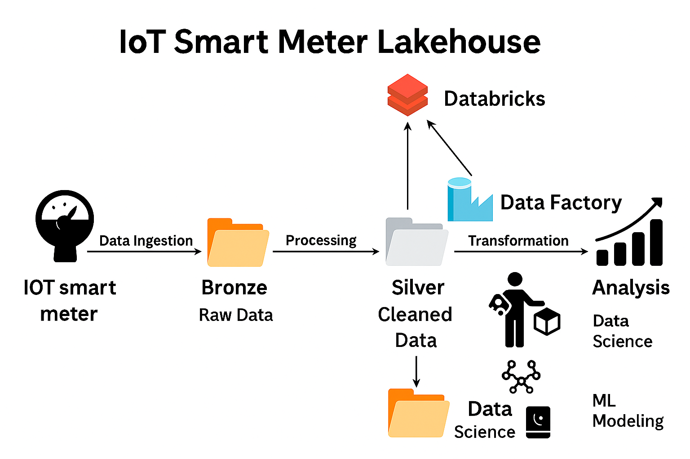

# ⚡ IoT Smart Meter Data Engineering Project

This project simulates a **real-time IoT Data Pipeline** for smart meters using **Azure Data Engineering + ML Lakehouse** architecture.  
It demonstrates how to ingest, process, transform, and analyze IoT telemetry data for **energy consumption forecasting**.

---

## 🚀 Architecture Overview

🔹 IoT Smart Meter → Azure IoT Central  
🔹 IoT Hub (Event Hub-compatible) → Azure Event Hub (Basic Tier)  
🔹 Stream Ingestion → Azure Databricks (Structured Streaming)  
🔹 Bronze → Silver → Gold Lakehouse Architecture  
🔹 ML Forecasting (LightGBM) → Azure Synapse + Power BI for analytics  



---

## 📂 Repo Structure

- **data/** → Sample IoT data (raw & processed)  
- **notebooks/** → Jupyter notebooks (ingestion, transformation, ML)  
- **src/** → Python scripts for ingestion, transformation & ML  
- **diagrams/** → Flowcharts & architecture diagrams  

---

## ⚙️ Tech Stack

- **Cloud**: Azure IoT Central, Event Hub, Databricks, Data Lake Gen2, Synapse  
- **Streaming**: PySpark Structured Streaming  
- **Storage**: Delta Lake (Bronze, Silver, Gold)  
- **Machine Learning**: LightGBM (Forecasting UsageKWh)  
- **Visualization**: Power BI / Synapse SQL  

---

## 📊 Dataset Schema

Sample IoT Telemetry (JSON):

```json
{
    "_eventcreationtime": "2025-09-02T19:24:28.531Z",
    "UsageKWh": 25.46706175993402,
    "Voltage": 49.605655408657434,
    "Current": 17.52648988380854,
    "Location": {
        "alt": 522.9712,
        "lat": 38.187,
        "lon": -85.853
    },
    "Timestamp": 57.701728868271154,
    "_eventtype": "Telemetry",
    "_timestamp": "2025-09-02T19:24:28.644Z"
}
